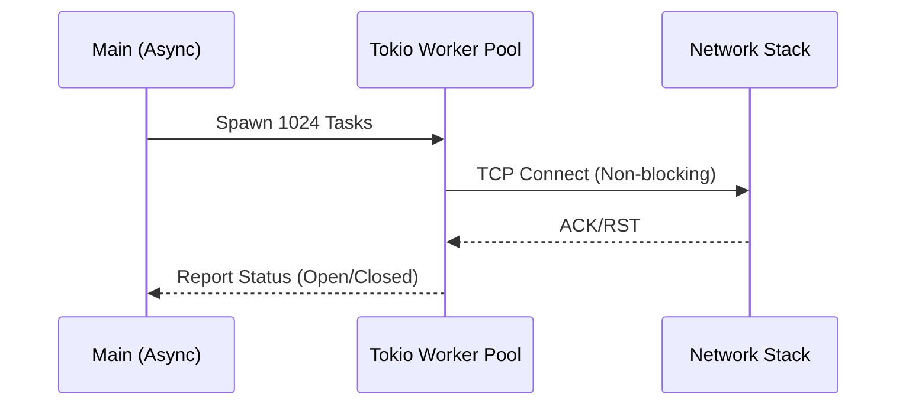

# High-Speed Port Scanner (Rust)

A multi-threaded, asynchronous port scanner built with **Tokio** for maximum throughput.

## ⚡ Performance
By utilizing Rust's zero-cost abstractions and the Tokio runtime, this scanner can handle thousands of concurrent connection attempts without the overhead of OS threads.

## 🛠️ Technology Stack
- **Language**: Rust 2021
- **Async Runtime**: Tokio
- **Concurrency Model**: M:N (Green threads)

## 📊 Workflow


## 📖 Usage
```bash
cargo run --release
```